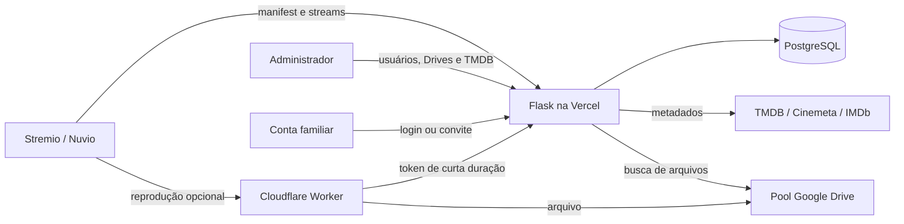

# Stream Helium

[](https://github.com/HeliumMarcos/StreamHelium/actions/workflows/tests.yml)
[](https://stream-helium.vercel.app/)

Add-on privado do Stremio que procura filmes e episódios em contas do Google
Drive administradas em pool. O sistema oferece contas individuais para
familiares, painel administrativo, expiração de acesso, limite de dispositivo,
metadados TMDB e entrega opcional de vídeo por um Worker Cloudflare.

> Use apenas arquivos que você tenha autorização para armazenar e reproduzir.

## Estado atual

- Aplicação Flask publicada na Vercel.
- PostgreSQL para usuários, sessões, configurações e credenciais criptografadas.
- Contas Google Drive conectadas somente pelo administrador.
- Contas familiares distribuídas automaticamente entre os Drives disponíveis.
- Chaves TMDB administradas em pool.
- Login familiar por e-mail e senha, além do link individual de convite.
- Uma URL de manifesto diferente para cada conta familiar.
- Proxy Cloudflare opcional, com suporte a `Range`, `HEAD` e CORS.
- Interface responsiva e acessível, com feedback de carregamento, erros e ações.
- Proteção CSRF no painel e `state` OAuth aleatório, vinculado à sessão e de uso único.

Produção: [stream-helium.vercel.app](https://stream-helium.vercel.app/)

## Arquitetura



O `refresh_token` de cada conta Google fica criptografado no PostgreSQL. Quando
o proxy está ativo, o Worker solicita à aplicação um `access_token` de curta
duração; ele não precisa manter outra cópia dos refresh tokens.

## Como o fluxo funciona

### Administração

1. O administrador entra em `/admin` com `ADMIN_PASSWORD`.
2. Em `/admin/drives`, cadastra e conecta uma ou mais contas Google.
3. Em `/admin/tmdb`, cadastra as chaves da API TMDB.
4. Em `/admin`, cria uma conta familiar com e-mail, nome e validade opcional.
5. O sistema atribui a nova conta ao Drive ativo e conectado com menos usuários.
6. O administrador envia o link `/connect/<token>` para a pessoa convidada.

O painel também permite:

- editar e ativar/desativar contas;
- renovar o acesso por 30 dias ou definir uma data exata;
- fixar uma família em um Drive ou voltar ao balanceamento automático;
- liberar o dispositivo ativo;
- resetar a senha;
- copiar o convite;
- reconectar, desativar ou remover contas Drive;
- ativar/desativar chaves TMDB e o proxy Cloudflare.

Ao remover um Drive, as famílias afetadas são redistribuídas entre os outros
Drives ativos e conectados. Se nenhum estiver disponível, elas ficam sem Drive
até uma nova atribuição.

### Conta familiar

1. A pessoa abre o convite e define uma senha de pelo menos seis caracteres.
2. Depois, pode entrar por `/login` com e-mail e senha.
3. A página individual `/u/<user_id>/` mostra o estado da conta, do Drive, da
   TMDB e do proxy.
4. A pessoa instala no Stremio o manifesto exibido nessa página.

Contas desativadas, expiradas ou temporariamente sem Drive recebem uma
explicação amigável na página individual. Os endpoints consumidos pelo Stremio
continuam indisponíveis até a regularização.

### Busca e reprodução

Quando o Stremio solicita um filme ou episódio, a aplicação:

1. valida o tipo e o identificador IMDb/TMDB;
2. resolve títulos, títulos alternativos, ano, temporada e episódio;
3. pesquisa arquivos em Meu Drive e Drives compartilhados;
4. remove duplicados e falsos positivos;
5. confere ano para filmes e `SxxEyy` para séries;
6. ordena por resolução, fonte, HDR/Dolby Vision, áudio e idioma;
7. retorna a URL direta do Google ou a URL do Worker Cloudflare.

Os resultados mostram resolução, HDR/DV, áudio, canais, serviço de origem,
fonte, codec e tamanho do arquivo.

## Organização recomendada dos arquivos

Filmes devem conter o título e, preferencialmente, o ano:

```text
Nome do Filme 2024 2160p WEB-DL DDP5.1.mkv
Nome.Do.Filme.2024.1080p.BluRay.x265.mkv
```

Episódios devem conter temporada e episódio. Os formatos reconhecidos incluem:

```text
Nome da Série S01E01.mkv
Nome da Série S1 E1.mkv
Nome da Série 1x01.mkv
Nome da Série Season 1 Episode 1.mkv
```

Também é possível colocar o ID IMDb no nome do arquivo para reforçar a
correspondência.

## Rotas principais

| Rota | Finalidade |
|---|---|
| `/login` | Login da conta familiar |
| `/home` | Redireciona a família autenticada para sua página |
| `/connect/<invite_token>` | Convite e definição de senha |
| `/u/<user_id>/` | Página e instruções da conta familiar |
| `/u/<user_id>/manifest.json` | Manifesto individual do Stremio |
| `/u/<user_id>/stream/<tipo>/<id>.json` | Busca de streams |
| `/u/<user_id>/health` | Diagnóstico da conta e do Drive |
| `/health` | Diagnóstico geral da aplicação e do banco |
| `/admin` | Gestão das contas familiares |
| `/admin/drives` | Gestão do pool Google Drive |
| `/admin/tmdb` | Gestão do pool de chaves TMDB |
| `/internal/drive-token/<account_id>` | Token temporário para o Worker |

O `user_id` presente nas URLs do Stremio funciona como uma credencial de
acesso. Não publique nem compartilhe o manifesto individual fora da pessoa
destinatária.

## Pré-requisitos

- Python 3.11;
- PostgreSQL;
- projeto no Google Cloud com a Google Drive API habilitada;
- cliente OAuth 2.0 do tipo **Web application**;
- projeto na Vercel;
- opcionalmente, conta Cloudflare Workers e chaves da API TMDB.

## Configuração do Google Cloud

1. Crie ou selecione um projeto no
   [Google Cloud Console](https://console.cloud.google.com/).
2. Habilite a **Google Drive API**.
3. Configure a tela de consentimento OAuth.
4. Adicione as contas Google que poderão autorizar como usuários de teste,
   enquanto o aplicativo estiver no modo de testes.
5. Crie um cliente OAuth 2.0 do tipo **Web application**.
6. Cadastre a URI de redirecionamento:

   ```text
   https://stream-helium.vercel.app/oauth/callback
   ```

   Em outra instalação, substitua pelo domínio real. Cadastre também qualquer
   domínio personalizado utilizado.

7. Guarde o Client ID e o Client Secret nas variáveis da Vercel.

> **Importante:** em **Google Auth Platform → Público-alvo**, deixe o status de
> publicação como **Em produção**. Aplicações externas no modo **Teste** que
> solicitam acesso ao Drive recebem refresh tokens que expiram em 7 dias. Ao
> mudar para produção, reconecte cada conta Drive uma última vez para substituir
> os tokens de teste já emitidos.

O escopo solicitado pela aplicação é somente leitura:
`https://www.googleapis.com/auth/drive.readonly`.

## Variáveis de ambiente

Configure os valores necessários em **Vercel → Settings → Environment
Variables**. Use valores distintos e seguros; nunca coloque segredos no Git.

| Variável | Obrigatória | Descrição |
|---|---:|---|
| `POSTGRES_URL` | Sim | Conexão PostgreSQL. `DATABASE_URL` é aceita como alternativa. |
| `SECRET_KEY` | Sim | Assina as sessões Flask. |
| `ENCRYPTION_KEY` | Sim | Chave Fernet usada para criptografar tokens Google e chaves TMDB. |
| `ADMIN_PASSWORD` | Sim | Senha única do painel administrativo. |
| `ADMIN_API_TOKEN` | Se usar o Catálogo | Credencial de serviço da API administrativa (`/api/admin`). Sem ela, a API inteira responde 503. |
| `GOOGLE_CLIENT_ID` | Sim | Client ID OAuth Web do Google. |
| `GOOGLE_CLIENT_SECRET` | Sim | Client Secret OAuth Web do Google. |
| `TMDB_API_KEY` | Não | Chave legada de fallback; prefira o pool em `/admin/tmdb`. |
| `CF_PROXY_URL` | Não | URL base do Worker Cloudflare. |
| `PROXY_SHARED_SECRET` | Se usar o proxy | Protege o endpoint interno de tokens e assina as URLs de reprodução. |
| `PLAYBACK_IDLE_SECONDS` | Não | Silêncio tolerado antes que outro dispositivo assuma a vez; padrão: `180`. |
| `DEVICE_SESSION_TTL_MINUTES` | Não | Limite antigo, por impressão do dispositivo; padrão: `240`. Só vale com o proxy desligado. |
| `ADMIN_WHATSAPP_NUMBER` | Não | Número com DDI/DDD usado nos links de suporte. |
| `LOG_LEVEL` | Não | Nível de log; padrão: `INFO`. |

> Sem `PROXY_SHARED_SECRET`, o addon emite URLs de proxy sem assinatura:
> elas não expiram e qualquer pessoa com o link consegue reproduzir o
> arquivo. Configure o segredo antes de ligar o proxy.

Com o proxy ligado, o limite de um dispositivo por família passa a ser
aplicado durante a reprodução, e não na abertura do título. O Worker
pergunta ao addon, no máximo uma vez a cada 45 segundos, se aquela sessão
ainda tem a vez. Uma sessão abandonada se libera sozinha em
`PLAYBACK_IDLE_SECONDS` — mas uma pausa mais longa que esse tempo também
permite que outro dispositivo assuma, porque um player pausado com buffer
cheio para de pedir bytes.

Os dois lados falham liberando: se o banco ficar fora do ar ou o addon
ficar inacessível, a reprodução continua. O limite é uma conveniência e
não vale derrubar o vídeo da casa inteira.

Gere os segredos localmente:

```bash
python -c "import secrets; print(secrets.token_hex(32))"
python -c "from cryptography.fernet import Fernet; print(Fernet.generate_key().decode())"
```

O primeiro comando pode ser usado para `SECRET_KEY` e
`PROXY_SHARED_SECRET`. O segundo gera `ENCRYPTION_KEY`.

> Faça backup seguro de `ENCRYPTION_KEY`. Se ela for perdida ou alterada, os
> tokens e chaves já armazenados não poderão ser descriptografados.

A variável antiga `TOKEN` não é mais utilizada.

## Banco de dados

Conecte um PostgreSQL ao projeto Vercel e disponibilize `POSTGRES_URL` ou
`DATABASE_URL`. Na inicialização, a aplicação cria e atualiza de forma
idempotente as tabelas:

- `drive_accounts`;
- `users`;
- `tmdb_keys`;
- `device_sessions`;
- `settings`.

As migrações existentes são aditivas e usam `ADD COLUMN IF NOT EXISTS`.

## Primeira configuração em produção

1. Faça o deploy com todas as variáveis obrigatórias.
2. Abra `https://<domínio>/admin`.
3. Entre com `ADMIN_PASSWORD`.
4. Em **Contas Drive**, adicione uma conta e clique em **Conectar ao Google**.
5. Autorize a conta que possui acesso à biblioteca compartilhada.
6. Repita para cada conta desejada no pool.
7. Em **Chaves TMDB**, adicione pelo menos uma chave ativa.
8. Em **Famílias**, crie os acessos e envie os respectivos convites.

Não é necessário gerar refresh tokens por Colab nem cadastrar credenciais
Google em cada conta familiar.

## API administrativa

O Catálogo (`catalogo.heliummarcos.com.br`) administra este sistema por
`/api/admin`, para que famílias, contas Drive e chaves TMDB tenham um
painel só. As telas em `/admin` continuam funcionando e são o acesso de
emergência.

A autenticação é por `Authorization: Bearer $ADMIN_API_TOKEN`, comparado
em tempo constante. É de propósito uma credencial diferente da
`ADMIN_PASSWORD`: aquela é de uma pessoa digitando num formulário, e uma
credencial de serviço vazada precisa poder ser trocada sem trancar o
administrador fora do próprio painel. Gere com:

```bash
python -c "import secrets; print(secrets.token_urlsafe(48))"
```

Com `ADMIN_API_TOKEN` ausente, toda a API responde `503` — um ambiente
ainda não configurado fica fechado, e não aberto.

| Método e rota | Finalidade |
|---|---|
| `GET /api/admin/ping` | Confere token e conexão sem tocar em dados |
| `GET /api/admin/overview` | Contadores do painel |
| `GET POST /api/admin/users` | Lista e cria contas de família (com `device`: aparelho, ocioso há quanto tempo, e se está reproduzindo agora) |
| `GET PATCH DELETE /api/admin/users/<id>` | Lê, edita e remove |
| `PUT /api/admin/users/<id>/active` | Ativa/desativa (estado explícito) |
| `POST /api/admin/users/<id>/renew` | Renova por N dias |
| `PUT /api/admin/users/<id>/drive` | Fixa um Drive, ou volta ao automático |
| `DELETE /api/admin/users/<id>/password` | Reseta a senha |
| `DELETE /api/admin/users/<id>/device` | Libera as duas travas de dispositivo |
| `GET POST /api/admin/drives` | Lista e cria contas Drive |
| `PUT /api/admin/drives/<id>/active` | Ativa/desativa |
| `DELETE /api/admin/drives/<id>` | Remove e redistribui as famílias |
| `GET POST /api/admin/tmdb-keys` | Lista e cria chaves |
| `PUT /api/admin/tmdb-keys/<id>/active` | Ativa/desativa |
| `DELETE /api/admin/tmdb-keys/<id>` | Remove |
| `GET /api/admin/settings` | Estado do proxy |
| `PUT /api/admin/settings/proxy` | Liga/desliga o proxy |

As regras ficam em `sgd/admin_actions.py`, compartilhadas com as telas
HTML — as duas camadas são finas por cima delas, para não divergirem.

Conectar uma conta Drive ao Google continua sendo feito aqui, no
navegador: a URI de callback do OAuth está registrada neste domínio.

O que nunca sai pela API: hashes de senha, refresh tokens do Google e as
chaves TMDB em claro — dessas vão só os quatro últimos dígitos.

## Cloudflare Worker

O arquivo [`cf_proxy.js`](./cf_proxy.js) implementa a entrega opcional de
vídeo. O [`wrangler.toml`](./wrangler.toml) já aponta `TOKEN_ENDPOINT` para a
aplicação de produção.

Na Vercel:

```text
PROXY_SHARED_SECRET=<segredo aleatório>
CF_PROXY_URL=https://<seu-worker>.workers.dev
```

No Worker, defina o mesmo segredo:

```bash
npx wrangler secret put TOKEN_ENDPOINT_SECRET
npx wrangler deploy
```

Com `TOKEN_ENDPOINT` e `TOKEN_ENDPOINT_SECRET` configurados, o Worker solicita
tokens temporários à aplicação. O secret legado `ACCOUNTS` existe apenas como
fallback de migração e pode ser removido depois que o endpoint estiver
confirmadamente funcionando.

O proxy não mantém cache de borda dos vídeos: requisições de reprodução usam
normalmente `206 Partial Content`, e a prioridade é preservar corretamente
`Range`, CORS e compatibilidade com os players.

## Desenvolvimento local

### Windows PowerShell

```powershell
py -3.11 -m venv .venv
.\.venv\Scripts\Activate.ps1
python -m pip install -r requirements-dev.txt

$env:SECRET_KEY = "desenvolvimento-local"
$env:ENCRYPTION_KEY = "<chave-fernet>"
$env:ADMIN_PASSWORD = "<senha-local>"
$env:POSTGRES_URL = "<conexao-postgres>"
$env:GOOGLE_CLIENT_ID = "<client-id>"
$env:GOOGLE_CLIENT_SECRET = "<client-secret>"

python -m flask --app index:app run --debug
```

### Linux/macOS

```bash
python3.11 -m venv .venv
source .venv/bin/activate
python -m pip install -r requirements-dev.txt

export SECRET_KEY="desenvolvimento-local"
export ENCRYPTION_KEY="<chave-fernet>"
export ADMIN_PASSWORD="<senha-local>"
export POSTGRES_URL="<conexao-postgres>"
export GOOGLE_CLIENT_ID="<client-id>"
export GOOGLE_CLIENT_SECRET="<client-secret>"

python -m flask --app index:app run --debug
```

O callback OAuth é montado com HTTPS e o host atual. Para conectar contas
Google, prefira um deployment de preview/produção com a URI correspondente
cadastrada no Google Cloud.

## Testes

```bash
python -m pytest -q
node --test tests/cf_proxy.test.mjs
node --check sgd/static/admin.js
```

O workflow [`.github/workflows/tests.yml`](./.github/workflows/tests.yml)
executa os testes Python 3.11 e Node.js em pushes para `main` e em pull
requests.

## Deploy na Vercel

O projeto usa [`vercel.json`](./vercel.json) e o runtime `@vercel/python`.
Com a integração GitHub ativa:

- branches e pull requests geram deployments de preview;
- merges em `main` geram deployments de produção;
- o alias principal é `https://stream-helium.vercel.app`.

Antes de promover mudanças, confirme os testes, o preview e os logs de runtime.

## Segurança

- Refresh tokens Google e chaves TMDB são criptografados com Fernet.
- Formulários administrativos usam tokens CSRF vinculados à sessão.
- O token CSRF é renovado após o login administrativo.
- O OAuth Google usa `state` aleatório, vinculado à sessão e de uso único.
- O endpoint do Worker exige `Authorization: Bearer` e segredo compartilhado.
- Respostas do endpoint de token usam `Cache-Control: no-store`.
- Senhas familiares são armazenadas com hash do Werkzeug.
- Links externos do painel usam `noopener noreferrer`.
- URLs individuais inválidas, expiradas ou inativas não revelam dados nos
  endpoints do Stremio.

O limite de um dispositivo por família usa uma impressão aproximada formada
por User-Agent e IP, pois o protocolo HTTP do Stremio não fornece um ID real de
instalação. Por isso, ele é um controle operacional, não uma barreira
criptográfica.

## Estrutura do projeto

```text
index.py                         entrada Flask para a Vercel
sgd/admin.py                     painel, regras administrativas e CSRF
sgd/family_auth.py               login e senha das contas familiares
sgd/oauth.py                     autorização Google das contas Drive
sgd/tenancy.py                   resolução de usuário e Drive por requisição
sgd/db.py                        schema e acesso ao PostgreSQL
sgd/gdrive.py                    integração com a API Google Drive
sgd/meta.py                      metadados TMDB/Cinemeta/IMDb
sgd/streams.py                   filtragem, ranking e URLs de reprodução
sgd/proxy_token.py               tokens temporários para o Worker
sgd/templates/                   templates Jinja
sgd/static/                      CSS e JavaScript compartilhados
cf_proxy.js                      Worker Cloudflare
wrangler.toml                    configuração do Worker
tests/                           testes Python e Node.js
```

## Diagnóstico rápido

- `/health` retorna `503`: confira a conexão PostgreSQL.
- O Drive não conecta: confirme Client ID, Client Secret, URI de callback e
  usuários de teste no Google Cloud.
- A família recebe acesso indisponível: verifique status, expiração e Drive
  atribuído no painel.
- O segundo dispositivo é bloqueado: use **Liberar** no painel ou aguarde o
  TTL configurado.
- O proxy retorna `502`: confira `PROXY_SHARED_SECRET`,
  `TOKEN_ENDPOINT_SECRET`, conta Drive ativa e logs do Worker.
- IDs `tmdb:` não resolvem: cadastre uma chave ativa em `/admin/tmdb`.

## Créditos

O projeto evoluiu a partir do trabalho de
[`ssnjr2002/stremio-gdrive`](https://github.com/ssnjr2002/stremio-gdrive), com
adaptações para multiusuário, pools administrados, Vercel, PostgreSQL e
Cloudflare Worker.
